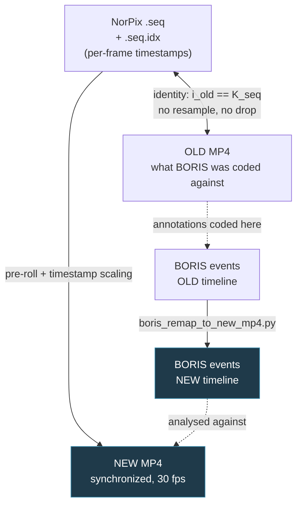
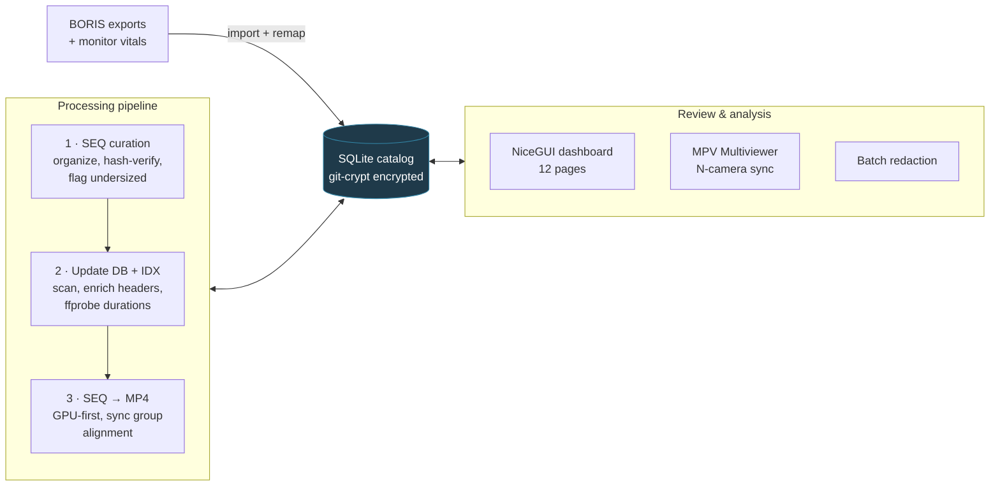

# ScalpelLab

**Research data infrastructure for a multi-camera operating room: turns raw proprietary camera output into synchronized, redacted, annotated video that behavioural researchers can actually analyse.**

Eight cameras record every case in the OR. They start at slightly different moments, write a proprietary NorPix `.seq` format, and produce footage that cannot be shared until the patient monitors in frame are redacted. Researchers then annotate behaviour in BORIS against those videos — and the annotations are only meaningful if every frame index still points at the same instant it did when the coder made the call.

ScalpelLab is the tooling that holds that chain together: ingestion, a SQLite catalog of what exists, format conversion, timeline reconciliation, privacy redaction, and a synchronized review tool.

---

## At a glance

| | |
|---|---|
| **Scale** | ~18.9k lines of Python across 56 modules — dashboard, pipeline, and review tool |
| **Cameras** | 8 per case, each on its own clock, reconciled to one synchronization group |
| **Catalog** | SQLite: recordings, SEQ/MP4 status, parsed SEQ headers, BORIS events, monitor vitals |
| **Privacy** | The database is **git-crypt encrypted** in this public repo; redaction is batch-driven from catalog timing tables |
| **Validation** | 19 tests pass on a clean clone; CI runs the suite, a compileall sweep, and a config import on Windows |

## The problem

Recording surgery is the easy part. The problems come after:

1. **Eight cameras, eight clocks.** Each starts when its operator hits record. "Frame 900" means a different moment on every camera unless the whole case is reconciled to one origin.
2. **The source format is proprietary and fragile.** NorPix `.seq` files need a companion `.seq.idx` to be seekable. Those companions go missing or get truncated, and a `.seq` without a valid index cannot be converted or trusted.
3. **Redaction is mandatory and mechanical.** Patient and ventilator monitors are in frame. Every case needs the same regions blacked out over the same time ranges — hundreds of files, driven from data, not by hand.
4. **Re-encoding invalidates existing research.** Behavioural annotations were coded in BORIS against the *original* exports. Producing new synchronized MP4s moves every frame index. Without a remap, thousands of hours of coding silently stop pointing at the right moments.

## Timeline reconciliation — the interesting part

This is the constraint the rest of the system is built around.



Two facts make the remap tractable, and both had to be *established* rather than assumed:

- **OLD MP4 ↔ SEQ is the identity.** The original export preserved SEQ frames one-to-one — no resampling, no duplication, no dropped frames, no FPS conversion. So an annotation at OLD frame `i` refers to SEQ record `i`.
- **SEQ → NEW MP4 is a timestamp projection**, not a frame copy. Each camera's frames are placed on a common 30 fps grid using the per-frame timestamps in its `.seq.idx`, offset by a pre-roll that aligns it to the earliest start in its synchronization group:

  ```python
  new_pre_roll_frames = round((first_frame_time - group_t_global_start) * 30)
  new_frame = new_pre_roll_frames + round((idx_timestamp[i_old] - idx_timestamp[0]) * 30)
  ```

The pre-roll belongs *only* to the SEQ → NEW stage; applying it to the OLD ↔ SEQ mapping would shift every annotation by the camera's start offset. `scripts/helpers/boris_remap_to_new_mp4.py` writes remapped `*_new_mp4.csv` files alongside each source export rather than overwriting them, so the original coding stays intact and the remap stays auditable. Cases where the rules do not hold are enumerated as explicit exceptions in [`docs/new recordings formula.md`](docs/new%20recordings%20formula.md) instead of being quietly mapped anyway.

## Key engineering challenges

**Deciding what is even convertible.** A SEQ file is only safe to convert if its IDX exists, its header parses, its frame timestamps are sane, and it is large enough to be a real recording. Rather than scatter those checks through the converter, they are encoded once as a database view (`cur_sync_status.is_syncable`) that the conversion planner reads. The gate and the dashboard therefore cannot disagree.

**Repairing proprietary index files.** `repair_seq_idx.py` audits `.seq.idx` companions and rebuilds them from the SEQ body when they are missing or truncated. It checkpoints per file, so an interrupted multi-hour pass over a thousand recordings resumes instead of restarting.

**Redaction driven by data, not by hand.** `batch_black_squere.py` reads case timing ranges from `mp4_times` and applies the same masking across every affected recording, tracking what has been processed so a rerun is incremental.

**Reviewing eight angles at once.** `MPV_Multiviewer/` drives N libmpv players over IPC from a Tkinter UI, scrubs them together, and writes per-camera offset corrections back to the catalog — so a sync correction found during review becomes data the pipeline uses, not a note in someone's file.

**Publishing research tooling without publishing research data.** The catalog is real: it names cases, dates and cameras. It is committed as a `git-crypt` encrypted blob, so the schema, the queries and the entire application are public and reviewable while the contents are not. Generated pipeline checkpoints, which embed absolute paths into the data tree, are gitignored for the same reason.

## Architecture



The catalog is the coordination point: the pipeline writes status into it, the dashboard and review tools read from it, and the redaction and conversion planners take their inputs from views over it rather than from the filesystem.

## Tech stack

Python 3.11 · SQLite (+ `git-crypt`) · NiceGUI + pywebview (desktop dashboard) · Plotly · pandas / NumPy · Tkinter + libmpv (review tool) · FFmpeg / ffprobe with NVENC · NorPix SequenceViewer · PyMuPDF · pytest · GitHub Actions

## Repository structure

```text
app/                  NiceGUI desktop dashboard (~4.7k lines, 12 pages)
scripts/              the pipeline (~11.2k lines)
  1_seq_curation.py     organize + verify raw SEQ exports
  2_update_db.py        scan trees, enrich SEQ metadata, reconcile status
  3_seq_to_mp4_convert.py  GPU-first conversion with sync-group alignment
  helpers/              IDX repair, BORIS import + remap, redaction, comparison
MPV_Multiviewer/      Tkinter + libmpv synchronized review tool (~1.9k lines)
docs/                 SEQ/IDX format references, schema notes, frame-mapping spec
tests/                7 files - unit, smoke, and an opt-in end-to-end pipeline test
config.py             all paths in one place; `python config.py` validates them
```

## Testing

```bash
pip install -r requirements.txt
python -m pytest tests/ -q      # 19 passed, 1 skipped on a clean clone
```

The end-to-end pipeline test drives the three real scripts as subprocesses and is **opt-in**: it skips unless `SCALPELLAB_TEST_SAMPLE_DIR` points at a small SEQ sample *and* ffmpeg / mkvmerge / NorPix are installed. See [`tests/README.md`](tests/README.md) for setting one up.

**Not covered by tests:** anything needing real recordings or the vendor tools — actual SEQ→MP4 conversion, IDX creation via NorPix, redaction output, and the MPV review tool. Those are exercised by operating the system.

## Limitations

- **Windows-oriented.** Paths, drive letters and the NorPix/mpv integrations assume Windows.
- **The database is encrypted and the key is not public.** You can read the schema, the queries and every line of application code, but you cannot run the dashboard against real data without the key and the recordings.
- **No schema migrations.** Changes are applied directly against the live SQLite file; back up first, then re-export the diagram with `scripts/helpers/sqlite_to_dbdiagram.py`.
- **Vendor tools are not bundled.** FFmpeg, mpv and NorPix SequenceViewer must be installed separately.
- **Single-operator tooling.** There is no multi-user access control; it assumes one researcher on one workstation.

## Future improvements

- A migration framework, so schema changes stop being a manual `sqlite3` session against live research data.
- A small synthetic SEQ fixture generator, which would let the end-to-end pipeline test run in CI instead of only on a machine with real recordings.
- Making the sync-group alignment reproducible from the catalog alone, so a conversion can be re-derived years later without the original working directory.

---
## Quick Start

### 1. Install dependencies

```bash
pip install -r requirements.txt
```

### 2. Configure local paths

Edit [`config.py`](config.py) and set:

- `SEQ_ROOT` to your organized SEQ root
- `MP4_ROOT` to your MP4 recordings root
- `ANALYSES_ROOT` to your finalized per-case analysis root
  (`Analyses\Case_Analyses_synced`)
- `NORPIX_SEQUENCE_VIEWER_PATH` to the NorPix SequenceViewer executable used
  to create `.seq.idx` files

Expected layout:

```text
Sequence_Backup/                    Recordings/
└── DATA_YY-MM-DD/                  └── DATA_YY-MM-DD/
    └── CaseN/                          └── CaseN/
        └── CameraName/                     └── CameraName/
            ├── *.seq                           └── *.mp4
            └── *.seq.idx
```

`Analyses/Case_Analyses_synced/` holds the finalized, per-case analysis
artifacts (behavioral labels and monitor vitals) whose BORIS events have been
remapped onto the NEW MP4 timeline. Older, un-remapped analysis exports live
under `Analyses/un_synced/`.

```text
Analyses/
├── Case_Analyses_synced/
│   └── DATA_YY-MM-DD/
│       └── CaseN/
│           ├── Boris/
│           │   ├── <date>-caseN_raw.csv           # raw BORIS export (OLD MP4 timeline)
│           │   ├── <date>-caseN_standardized.csv  # cleaned/standardized events
│           │   └── <date>-caseN_*_new_mp4.csv     # events remapped to the NEW MP4 timeline
│           └── Monitor/
│               └── motior_data.csv                # per-case monitor vitals time series
└── un_synced/                                     # older analysis exports (not remapped)
    ├── Analyses_1/
    ├── Analyses_2/
    └── Analyses_2026-03-18/
```

File types:

- `*_raw.csv` — direct BORIS observation export; `Time`/`Image index` are on the
  OLD per-camera MP4 timeline (one frame per SEQ frame).
- `*_standardized.csv` — the same events after cleanup/normalization, used for
  downstream analysis.
- `*_new_mp4.csv` — produced by `scripts/helpers/boris_remap_to_new_mp4.py`;
  adds NEW-MP4 frame/time columns via `docs/new recordings formula.md`.
- `motior_data.csv` — exported patient-monitor vital signs for the case
  (imported by `scripts/helpers/import_analysis_finale.py`).

### 3. Validate configuration

```bash
python config.py
```

### 4. Launch the desktop app

```bash
python run_app.py
```

`run_app.py` starts the NiceGUI app via `python -m app.app`, which opens a
native pywebview window. The Home page Configuration panel can also edit and
persist the DB, SEQ root, MP4 root, and NorPix SequenceViewer paths.

## Main Components

### NiceGUI App

The dashboard lives under [`app/`](app/) and currently includes:

- [`app/app.py`](app/app.py): entry point, Home dashboard, DB selector, and
  the Configuration panel for editing/persisting paths.
- [`app/pages/database.py`](app/pages/database.py): browse tables, inspect
  schema, insert rows, delete rows, and view the ERD from `docs/ERD.pdf`.
- [`app/pages/anesthesiology.py`](app/pages/anesthesiology.py): roster and
  seniority view over `cur_seniority` + `recording_details`.
- [`app/pages/mp4.py`](app/pages/mp4.py): MP4 coverage and statistics over
  `mp4_status` and the `cur_mp4_*` views.
- [`app/pages/seq.py`](app/pages/seq.py): SEQ inventory plus `seq_enriched`
  time-drift analysis.
- [`app/pages/boris.py`](app/pages/boris.py): BORIS event START/STOP pairing
  and interval analysis.
- Launcher pages for the processing pipeline:
  [`nuk_export.py`](app/pages/nuk_export.py) (SEQ Curation),
  [`update_db.py`](app/pages/update_db.py) (Update DB + IDX), and
  [`seq_to_mp4.py`](app/pages/seq_to_mp4.py) (SEQ → MP4).

The sidebar is organized into **Dashboards & Monitoring** for read/inspection
pages and **Processing Pipeline** for operational actions.

### Database And Schema

- [`ScalpelDatabase.sqlite`](ScalpelDatabase.sqlite) is the local working
  database expected by default in the project root.
- There is no migration framework. Schema changes are applied directly with
  `sqlite3` against the live database — back up first, then re-export the
  schema with `scripts/helpers/sqlite_to_dbdiagram.py`.
- [`docs/scalpel_dbdiagram.txt`](docs/scalpel_dbdiagram.txt) is a dbdiagram.io
  schema export.
- [`docs/project_context/`](docs/project_context/) contains deeper notes on the
  SQLite schema and NorPix SEQ / IDX formats.

### Main Scripts

- [`scripts/1_seq_curation.py`](scripts/1_seq_curation.py): curate raw
  SEQ exports into `DATA_YY-MM-DD/CaseN/CameraName`, copy companion files,
  verify hashes, and flag undersized files as junk.
- [`scripts/2_update_db.py`](scripts/2_update_db.py): scan SEQ and MP4 trees,
  update `seq_status` and `mp4_status`, optionally calculate durations with
  `ffprobe`, enrich SEQ metadata, and preserve unmanaged DB columns.
- [`scripts/3_seq_to_mp4_convert.py`](scripts/3_seq_to_mp4_convert.py): convert
  missing SEQ recordings to MP4, with GPU-first workflow and fallback behavior.
- [`scripts/helpers/import_boris_tags.py`](scripts/helpers/import_boris_tags.py): import BORIS
  TSV exports into `boris_events` and maintain BORIS-derived views.
- [`scripts/helpers/batch_black_squere.py`](scripts/helpers/batch_black_squere.py):
  batch-redact videos from database timing data in `mp4_times`.

Processing Pipeline order:

1. SEQ Curation.
2. Update DB + Create IDX files.
3. Analyze SEQ Fields.
4. SEQ to MP4, followed by a DB refresh so MP4 status reflects the latest files.

IDX creation uses NorPix SequenceViewer, configured by
`config.NORPIX_SEQUENCE_VIEWER_PATH` and editable from the Home page. The
existing `repair_seq_idx.py` helper remains an audit/repair path, not the
primary creation flow.

Pipeline logs are written under `logs/`, grouped by step:

```text
logs/
├── seq_curation/
├── db_update/
├── idx_creation/
├── seq_analysis/
└── seq_to_mp4/
```

### Helper Utilities

- [`scripts/helpers/analyze_seq_fields.py`](scripts/helpers/analyze_seq_fields.py):
  optional SEQ field inspection used by the DB updater.
- [`scripts/helpers/repair_seq_idx.py`](scripts/helpers/repair_seq_idx.py):
  audit and rebuild NorPix `.seq.idx` files from SEQ bodies, with checkpointing
  in `docs/seq_idx_repair_tracking.json` (gitignored; created on first run).
- [`scripts/helpers/backup_dir.py`](scripts/helpers/backup_dir.py): copy files
  while preserving source structure.
- [`scripts/helpers/cut_video.py`](scripts/helpers/cut_video.py): cut video
  segments with FFmpeg stream copy.
- [`scripts/helpers/boris_remap_to_new_mp4.py`](scripts/helpers/boris_remap_to_new_mp4.py):
  remap BORIS event frame/time from the OLD MP4 to the NEW MP4 timeline, writing
  `*_new_mp4.csv` next to each source CSV (single `--csv` or `--all`).
- [`scripts/helpers/sqlite_to_dbdiagram.py`](scripts/helpers/sqlite_to_dbdiagram.py):
  export the SQLite schema to dbdiagram.io format.
- [`scripts/helpers/compare/compare_databases.py`](scripts/helpers/compare/compare_databases.py):
  compare two SQLite databases.
- [`scripts/helpers/compare/compare_mp4.py`](scripts/helpers/compare/compare_mp4.py):
  compare MP4 backups.
- [`scripts/helpers/compare/compare_seq.py`](scripts/helpers/compare/compare_seq.py):
  compare SEQ backups.

### MPV Multiviewer

[`MPV_Multiviewer/`](MPV_Multiviewer/) contains a Tkinter + MPV tool for loading
multiple camera angles, synchronizing playback offsets, and saving sync
corrections back to the database.

```bash
python MPV_Multiviewer/run_viewer.py
```

See [`MPV_Multiviewer/docs/user-guide.md`](MPV_Multiviewer/docs/user-guide.md)
for usage notes.

## Common Commands

```bash
python config.py
python run_app.py
python scripts/1_seq_curation.py
python scripts/2_update_db.py --dry-run
python scripts/2_update_db.py --skip-duration
python scripts/3_seq_to_mp4_convert.py
python scripts/helpers/import_boris_tags.py --dry-run
python scripts/helpers/batch_black_squere.py
python scripts/helpers/repair_seq_idx.py --dry-run
python scripts/helpers/cut_video.py
python scripts/helpers/sqlite_to_dbdiagram.py
python MPV_Multiviewer/run_viewer.py
```

## Database Overview

### Core Tables

- `recording_details`: case-level recording metadata.
- `analysis_information`: labeling metadata and optional BORIS event linkage.
- `anesthesiology`: anesthesiology roster and career dates.
- `seq_status`: SEQ presence, size, and path.
- `seq_enriched`: parsed SEQ header and IDX metadata cache.
- `mp4_status`: MP4 presence, size, duration, redaction metadata, sync offset,
  and path.
- `mp4_times`: case timing ranges used by redaction workflows.

Importer-created optional tables:

- `boris_events`: imported BORIS behavioral event rows.
- `monitor_samples`: imported per-sample monitor vitals.
- `monitor_case_summary`: per-case monitor import summary.

### Common Views

- `cur_mp4_missing`: cases where SEQ exists but MP4 is missing.
- `cur_sync_status`: per-camera `is_syncable` flag derived from `seq_enriched`,
  encoding the `3_seq_to_mp4_convert.py` planning gates (IDX present, header
  ok, valid frame timestamps, sane duration, ≥ 50 MB SEQ).
- `cur_seniority`: anesthesiology experience / status summary.
- `cur_mp4_status_statistics`: aggregated recording statistics used by the MP4
  dashboard.

### Camera Set

Default camera names from [`config.py`](config.py):

- `Cart_Center_2`
- `Cart_LT_4`
- `Cart_RT_1`
- `General_3`
- `Monitor`
- `Patient_Monitor`
- `Ventilator_Monitor`
- `Injection_Port`

## External Tools

Some functionality depends on tools outside Python:

- `ffmpeg` and `ffprobe` for conversion, probing, redaction, and cutting.
- NVIDIA NVENC for GPU-accelerated video workflows where available.
- NorPix SequenceViewer at `C:\Program Files\Common Files\NorPix\SequenceViewer.exe`
  by default for opening `.seq` files and creating `.seq.idx` companions.
- CLExport as a fallback SEQ export path in some legacy workflows.
- `mpv.exe` for synchronized multi-video playback in `MPV_Multiviewer`.

## Notes

- The repo is Windows-oriented; paths and examples assume Windows drive letters.
- The database file defaults to `ScalpelDatabase.sqlite` in the project root.
- `scripts/2_update_db.py` is designed to preserve columns it does not manage.
- The NiceGUI app can point at different configured paths through the Home page
  Configuration panel or the relevant `SCALPEL_*` environment variables.
